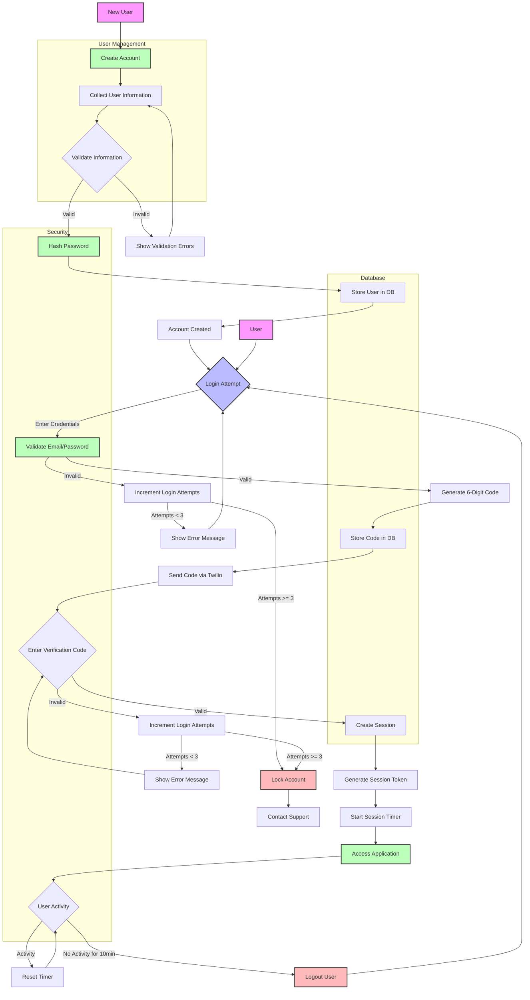

```mermaid
flowchart TD
    Start[New User] --> CreateAccount[Create Account]
    CreateAccount --> CollectInfo[Collect User Information]
    CollectInfo --> ValidateInfo{Validate Information}
    
    ValidateInfo -->|Invalid| ShowError[Show Validation Errors]
    ShowError --> CollectInfo
    
    ValidateInfo -->|Valid| HashPassword[Hash Password]
    HashPassword --> StoreUser[Store User in DB]
    StoreUser --> AccountCreated[Account Created]
    AccountCreated --> B
    
    A[User] --> B{Login Attempt}
    B -->|Enter Credentials| C[Validate Email/Password]
    
    C -->|Invalid| D[Increment Login Attempts]
    D -->|Attempts < 3| E[Show Error Message]
    E --> B
    
    D -->|Attempts >= 3| F[Lock Account]
    F --> G[Contact Support]
    
    C -->|Valid| H[Generate 6-Digit Code]
    H --> I[Store Code in DB]
    I --> J[Send Code via Twilio]
    
    J --> K{Enter Verification Code}
    K -->|Invalid| L[Increment Login Attempts]
    L -->|Attempts < 3| M[Show Error Message]
    M --> K
    
    L -->|Attempts >= 3| F
    
    K -->|Valid| N[Create Session]
    N --> O[Generate Session Token]
    O --> P[Start Session Timer]
    P --> Q[Access Application]
    
    Q --> R{User Activity}
    R -->|Activity| S[Reset Timer]
    S --> R
    
    R -->|No Activity for 10min| T[Logout User]
    T --> B

    subgraph Database
        StoreUser
        I
        N
    end

    subgraph Security
        HashPassword
        C
        K
        R
    end

    subgraph User Management
        CreateAccount
        CollectInfo
        ValidateInfo
    end

    style Start fill:#f9f,stroke:#333,stroke-width:2px
    style A fill:#f9f,stroke:#333,stroke-width:2px
    style B fill:#bbf,stroke:#333,stroke-width:2px
    style C fill:#bfb,stroke:#333,stroke-width:2px
    style F fill:#fbb,stroke:#333,stroke-width:2px
    style Q fill:#bfb,stroke:#333,stroke-width:2px
    style T fill:#fbb,stroke:#333,stroke-width:2px
    style CreateAccount fill:#bfb,stroke:#333,stroke-width:2px
    style HashPassword fill:#bfb,stroke:#333,stroke-width:2px
``` 